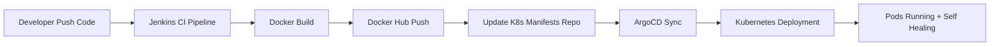

⭐ Final DevOps Project — Fully Implemented by Mohamed Hossam
# 🚀 CI/CD + GitOps with Jenkins, Docker, Kubernetes & ArgoCD  
### End-to-End Automated Delivery Pipeline

This project demonstrates a **production-grade CI/CD + GitOps pipeline** using:

- **Jenkins (CI)**
- **Docker (Image Build + Push)**
- **ArgoCD (Continuous Delivery)**
- **Kubernetes (Deployment)**
- **GitHub (GitOps Repo)**

The pipeline builds, tags, pushes, and deploys the application automatically using GitOps principles with full self-healing and auto-sync.

---

# 📌 Project Architecture


## 📌 project-diagram


---

# 🧩 Tech Stack

| Layer | Tool |
|------|------|
| CI | Jenkins |
| Containers | Docker |
| CD | ArgoCD |
| Cluster | Kubernetes |
| Registry | Docker Hub |
| Repo | GitHub |
| App | NodeJS |

---

# 📁 Project Structure

```
GitOps-ci-cd-with-Jenkins-and-Argocd/
│
├── app/                   
│   ├── src/
│   ├── tests/
│   ├── package.json
│   ├── package-lock.json
│   └── Dockerfile
│
├── jenkins/
│   └── Jenkinsfile        
│
├── manifests/             
│   ├── deployment.yaml
│   ├── service.yaml
│   └── kustomization.yaml
│
└── argocd/
    └── application.yaml   
```

---

# 🔧 Jenkinsfile (CI Pipeline)

```groovy
pipeline {
    agent any

    environment {
        REGISTRY = "docker.io"
        IMAGE = "mohamedhossam0/jenkins-nodejs"
        TAG = "${BUILD_NUMBER}"
    }

    stages {

        stage('Checkout Code') {
            steps {
                git branch: 'Master', url: 'https://github.com/MohamedHossamFouad/GitOps-ci-cd-with-Jenkins-and-Argocd.git'
            }
        }

        stage('Docker Login') {
            steps {
                script {
                    docker.withRegistry('https://index.docker.io/v1/', 'dockerhub') {}
                }
            }
        }

        stage('Build Image') {
            steps {
                script {
                    docker.build("${IMAGE}:${TAG}")
                }
            }
        }

        stage('Push Tagged Image') {
            steps {
                script {
                    docker.withRegistry('https://index.docker.io/v1/', 'dockerhub') {
                        docker.image("${IMAGE}:${TAG}").push()
                    }
                }
            }
        }

        stage('Push Latest Image') {
            steps {
                script {
                    sh "docker tag ${IMAGE}:${TAG} ${IMAGE}:latest"
                    docker.withRegistry('https://index.docker.io/v1/', 'dockerhub') {
                        docker.image("${IMAGE}:latest").push()
                    }
                }
            }
        }

        stage('Update Kubernetes Manifests') {
            steps {
                sh '''
                    sed -i "s|image: .*|image: ${IMAGE}:${TAG}|g" manifests/deployment.yaml
                '''
            }
        }

        stage('Commit & Push Updated Manifests') {
            steps {
                sh '''
                    git config user.email "jenkins@ci.com"
                    git config user.name "Jenkins CI"

                    git add manifests/deployment.yaml
                    git commit -m "Update image tag to ${TAG}"
                    git push https://<GITHUB_TOKEN>@github.com/MohamedHossamFouad/GitOps-ci-cd-with-Jenkins-and-Argocd.git
                '''
            }
        }
    }

    post {
        success { echo "Pipeline completed successfully!" }
        failure { echo "Pipeline failed!" }
    }
}
```
## 🟦 Jenkins Pipeline - SUCCESS


---

# 🐳 Dockerfile

```dockerfile
FROM node:16

WORKDIR /usr/src/app

COPY package*.json ./
RUN npm install

COPY . .

EXPOSE 3000

CMD ["npm", "start"]
```

---

# ☸️ Kubernetes Manifests

### deployment.yaml

```yaml
apiVersion: apps/v1
kind: Deployment
metadata:
  name: project-k8s12
spec:
  replicas: 6
  selector:
    matchLabels:
      app: project-k8s12
  template:
    metadata:
      labels:
        app: project-k8s12
    spec:
      containers:
        - name: project-k8s12
          image: mohamedhossam0/jenkins-nodejs:latest
          ports:
            - containerPort: 3000
```
## 🟩 Kubernetes Pods Running


### service.yaml

```yaml
apiVersion: v1
kind: Service
metadata:
  name: project-k8s12
spec:
  type: LoadBalancer
  ports:
    - port: 80
      targetPort: 3000
      nodePort: 30080
  selector:
    app: project-k8s12
```

---

# 🎯 ArgoCD Application

```yaml
apiVersion: argoproj.io/v1alpha1
kind: Application
metadata:
  name: project-k8s12
  namespace: argocd
spec:
  project: default
  source:
    repoURL: 'https://github.com/MohamedHossamFouad/GitOps-ci-cd-with-Jenkins-and-Argocd.git'
    targetRevision: Master
    path: manifests
  destination:
    server: https://kubernetes.default.svc
    namespace: default
  syncPolicy:
    automated:
      prune: true
      selfHeal: true
```
## 🟩 ArgoCD Application - Synced & Healthy


---

# 🧪 End-to-End Flow (GitOps)

1. Developer pushes new code → GitHub  
2. Jenkins CI pipeline triggers  
3. Docker image built & pushed to Docker Hub  
4. Pipeline updates Kubernetes YAML image tag  
5. Manifest repo updated  
6. ArgoCD detects commit  
7. ArgoCD auto-syncs  
8. Kubernetes deploys new version  
9. Old pods terminated → new pods created  
10. ArgoCD self-heals if pods removed  

---

# 🏆 Outcome

This project implements:

- ✔ Full CI pipeline  
- ✔ Full GitOps CD pipeline  
- ✔ Auto rollout + sync  
- ✔ Versioned Docker images  
- ✔ Kubernetes multi-replica deployment  
- ✔ ArgoCD self-healing  
- ✔ Automated application delivery  

A complete **production-grade DevOps solution**.

---

# ✍️ Author

Mohamed Hossam Fouad  
DevOps | Cloud | System Administrator
